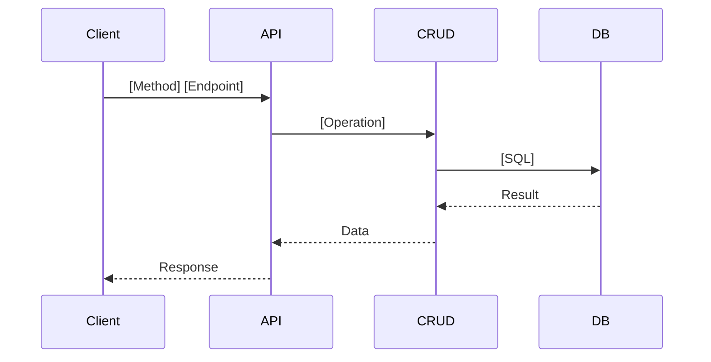

# Server Documenter Skill

This skill automates the creation of high-quality documentation for server-side implementations, following **Phase 6** of the `new-task.md` workflow. It ensures consistency by adopting the strict formatting used in the `011-goods-module` reference.

## Workflow

1.  **Verify Implementation**: Documentation is only generated after the feature is verified and implementation is stable.
2.  **Locate Prompt File**: Identify the agent-prompt file that defined the task (e.g., `prompts/agent-prompts/040-restricting-system-account-edits-2026-02-11.md`).
3.  **Create Directory**: Create a directory named after the prompt file (minus extension) in `prompts/agent-prompts/`.
4.  **Generate Documentation**: Create the following files in that directory:
    - `implementation.md`: Technical "as-built" reference.
    - `guide.md`: Professional user/integration guide.

## Templates

### 1. `implementation.md`

Use this template for technical references. Always separate sections with horizontal rules `---`.

```markdown
# [Feature Name] - Technical Implementation Reference

This document provides a technical "as-built" reference for the [Feature] implementation.

## Final Project Structure

```
app/
├── models/
│   ├── [model].py                 [NEW/MODIFIED] - Description
├── schemas/
│   └── [schema].py                [NEW/MODIFIED] - Description
├── crud/
│   ├── [crud].py                  [NEW/MODIFIED] - Description
└── api/
    └── v1/
        ├── endpoints/
        │   └── [endpoint].py      [NEW/MODIFIED] - Description
alembic/
└── versions/
    └── [id]_[migration].py        [NEW] - Database migration
```

---

## Database Layer

### [Model Name] Model (`app/models/[model].py`)

**Table Name**: `[table_name]`

**Columns**:
| Column | Type | Nullable | Default | Description |
|--------|------|----------|---------|-------------|
| `id` | Integer | No | Auto | Primary key |

**Constraints**:
- [List PKeys, Unique, etc.]

**Relationships**:
```python
# python code block for relationship definitions
```

---

## API Layer

### Endpoints Reference

**Base Path**: `/api/v1/[path]`

| Method | Endpoint | Permission | Status Code | Description |
|--------|----------|------------|-------------|-------------|
| GET | `/` | `res:read` | 200 | Description |

### Response Format
Endpoints must return the `ResponseCommon` wrapper.

### Request/Response Schemas

**[SchemaName]** ([Method] `[Endpoint]`):
```json
// JSON example
```

---

## Logic Review

### [Feature Sub-Component]

**Location**: `[file_path]`

```python
# Specific code snippet
```

**Purpose**: Description of why this logic exists.

---

## Migration Details

**Migration ID**: `[alembic_revision_id]`
**Description**: "[migration_message]"

**Rollback**: `alembic downgrade -1`
```

### 2. `guide.md`

Use this template for integration and user guides.

```markdown
# [Feature Name] - User Guide

## Overview
[Detailed business summary of the feature]

---

## Architecture

### System Flow


### Data Model
```mermaid
erDiagram
    [TABLE_A] ||--o{ [TABLE_B] : "description"
    [TABLE_C] {
        int id PK
        string field
    }
```

---

## Usage Examples

### [Use Case 1]

```bash
curl -X [METHOD] "http://localhost:8000/api/v1/[path]" \
  -H "Authorization: Bearer YOUR_TOKEN" \
  -H "Content-Type: application/json" \
  -d '{ ... }'
```

**Response** ([Status] [Label]):
```json
// Full valid JSON response
```

---

## Error Handling

### Common Error Responses

#### [Status Code] [Title]
```json
// JSON error response
```

---

## Permissions Required

| Operation | Permission | Description |
|-----------|------------|-------------|
| [Action] | `res:action` | Description |
```

## Best Practices

- **Strict Style**: Use the exact table headers and Mermaid diagram types specified.
- **Accurate Paths**: Always include file paths and exact migration IDs.
- **Valid JSON**: Ensure all JSON examples are valid and reflect the `ResponseCommon` wrapper.
- **Logical Grouping**: Group logic reviews by their functional area (e.g., Validation, Security, Data Processing).
